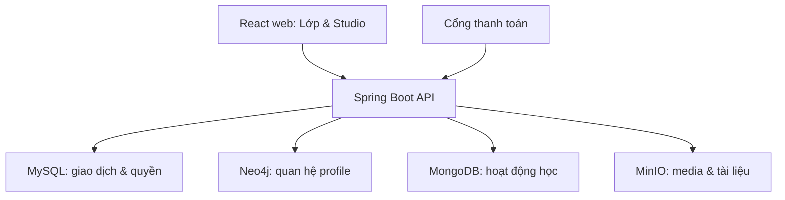
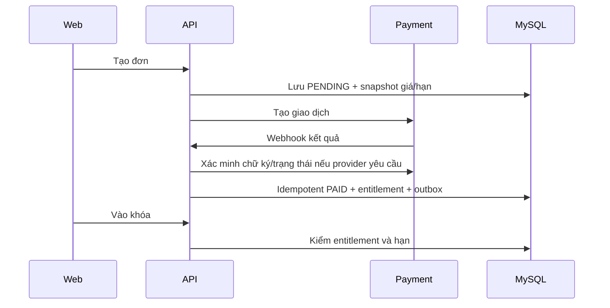

# Bộ tài liệu dự án lớp học — Mục lục và hướng dẫn

**Dự án:** Nền tảng lớp học trực tuyến · **Phiên bản:** 0.1 · **Trạng thái:** BẢN NHÁP · **Ngày:** 23/09/2026

> Tài liệu thiết kế theo thông tin chủ sản phẩm đã cung cấp. Các mục `[CẦN CHỐT]`, `[ĐIỀN KHI THỰC HIỆN]` chưa được xác nhận. Bản nháp không phải biên bản đã ký, kết quả kiểm thử hay cam kết dịch vụ.

## Tổng quan
Bộ 23 tài liệu theo 6 giai đoạn cho sản phẩm lớp học với 8 tab, Studio OWNER/STAFF, FREE/PRO, sản phẩm có hạn, kỳ thi theo nhóm/khóa, React TypeScript + Spring Boot 3.4.x (căn chỉnh theo D-09)/JDK 21, MySQL/Neo4j/MongoDB/MinIO. Đây là **bản khởi tạo có nội dung thực** từ cuộc trao đổi, chưa có phỏng vấn stakeholder độc lập, thiết kế Figma, code, test, ký duyệt hoặc triển khai.

## Danh mục
| Giai đoạn | Tệp |
|---|---|
| 1 Yêu cầu | `01-requirements/BRD.md`, `SRS-URS.md`, `WBS.md`, `Requirement-Signoff.md` |
| 2 Thiết kế | `02-design/HLD.md`, `LLD.md`, `UI-UX-Spec.md` |
| 3 Lập trình | `03-implementation/Coding-Standards.md`, `API-Spec.md`, `README-Dev.md`, `Unit-Test-Report.md` |
| 4 Kiểm thử | `04-testing/Test-Plan.md`, `Test-Cases.md`, `Bug-Log.md`, `Test-Summary.md`, `UAT-Signoff.md` |
| 5 Bàn giao | `05-release/Deployment-Plan.md`, `User-Manual.md`, `Operations-Manual.md`, `Handover-Acceptance.md` |
| 6 Bảo trì | `06-maintenance/SLA.md`, `Disaster-Recovery-Plan.md`, `Maintenance-Log.md` |

## Cách sử dụng
1. Chốt các quyết định D-01…D-06 trong BRD và các `[CẦN CHỐT]` cùng chủ sản phẩm.
2. Cập nhật SRS, WBS, HLD, LLD và UI song song; chỉ ký Requirement Sign-off sau khi phạm vi đã nhất quán.
3. Triển khai theo mốc; bổ sung OpenAPI và test report tự sinh từ code/build thật.
4. Điền kết quả test, UAT, deploy, bàn giao, SLA bằng bằng chứng thực tế và chữ ký đúng người.

## Giới hạn
Các mục tiêu tải, lịch, chi phí, nhà cung cấp thanh toán, SLA/RPO/RTO chưa có dữ liệu để cam kết. UI file là design specification/wireframe dạng văn bản; mockup Figma chưa thể tồn tại nếu chưa thiết kế. Mọi mẫu ký duyệt và kết quả đều ghi rõ trạng thái chưa thực hiện.

---

# BRD — Yêu cầu kinh doanh

**Dự án:** Nền tảng lớp học trực tuyến · **Phiên bản:** 0.1 · **Trạng thái:** BẢN NHÁP · **Ngày:** 23/09/2026

> Tài liệu thiết kế theo thông tin chủ sản phẩm đã cung cấp. Các mục `[CẦN CHỐT]`, `[ĐIỀN KHI THỰC HIỆN]` chưa được xác nhận. Bản nháp không phải biên bản đã ký, kết quả kiểm thử hay cam kết dịch vụ.

## 1. Mục tiêu và phạm vi
Xây nền tảng nhiều lớp học, mỗi lớp do một OWNER (giáo viên chủ nhiệm) sở hữu. Học viên học nội dung, thảo luận, làm bài thi, xem thành tích và mua sản phẩm. OWNER vận hành lớp qua Studio và phân quyền từng khu vực cho trợ lý/giáo viên giám sát. Mục tiêu đầu tiên là vận hành trọn vòng đời từ tạo lớp → học → thi → mua → kiểm soát quyền và theo dõi kết quả.

## 2. Các bên liên quan
| Bên | Nhu cầu | Quyết định cần xác nhận |
|---|---|---|
| Chủ sản phẩm | Phạm vi, thứ tự triển khai, doanh thu | Mô hình kinh doanh, chỉ số thành công |
| OWNER | Quản lớp, giao việc, bán khóa, tổ chức thi | Quyền nhân sự và quy trình xuất bản |
| STAFF | Quản lý phần được giao | Mức quyền theo module và theo khóa |
| Học viên | Học, thi, mua, theo dõi kết quả | Quyền riêng tư profile |
| Vận hành/CSKH | Hoàn tiền, xử lý đơn, sự cố | Quy trình hỗ trợ và đối soát |

## 3. Giá trị và chỉ số đề xuất
| Mã | Giá trị | Chỉ số đo lường đề xuất |
|---|---|---|
| BG-01 | Giáo viên tự mở và vận hành lớp | Số lớp hoạt động/tháng |
| BG-02 | Học viên học và đạt kết quả | Tỷ lệ vào bài đầu, hoàn thành khóa, tham gia thi |
| BG-03 | Bán nội dung có kiểm soát | Đơn thanh toán thành công, tỷ lệ mua, doanh thu thuần |
| BG-04 | Giảm công sức vận hành | Thời gian tạo khóa, chấm bài, xử lý quyền |
Các mục tiêu định lượng chưa được chủ sản phẩm xác nhận; không coi các chỉ số trên là KPI đã cam kết.

## 4. Phạm vi kinh doanh
**Trong phạm vi:** tài khoản; lớp; thành viên; bảng tin; khóa/chương/bài/video/tóm tắt/bài tập/hỏi đáp; tài liệu; cuộc thi; điểm và bảng xếp hạng; segment; profile/hành trình; cửa hàng; sản phẩm có giá và hạn; quyền FREE/PRO/quyền theo sản phẩm; Studio và phân quyền nhân sự; trang giới thiệu.

**Chưa chốt để đưa vào phạm vi:** tích hợp cổng thanh toán cụ thể, phát trực tiếp, chống gian lận nâng cao, mobile native, affiliate, AI gợi ý và chat realtime. Chỉ thêm bằng yêu cầu thay đổi đã đánh giá chi phí.

## 5. Quy tắc kinh doanh đã thống nhất
- OWNER toàn quyền đối với lớp mình và xem được mọi khóa học của lớp không cần mua.
- STAFF được OWNER cấp quyền theo vùng Studio và thao tác; việc quản lý không mặc nhiên cấp quyền xem nội dung mọi khóa.
- PRO xem nội dung PRO dùng chung trong lớp. Khóa bán riêng chỉ được học khi có quyền đúng sản phẩm còn hiệu lực; khóa miễn phí được học theo điều kiện lớp.
- Mỗi sản phẩm có giá, thời điểm bắt đầu và thời hạn quyền sử dụng. Hết quyền không xóa lịch sử học/thi.
- Cuộc thi có thể mở cho toàn lớp, PRO, người sở hữu một khóa cụ thể hoặc segment. Cuộc thi PRO mở cho toàn bộ PRO; cuộc thi theo khóa chỉ mở cho người có quyền đúng khóa.
- Điểm thi, điểm quy đổi xếp hạng và bậc thành tích là ba khái niệm khác nhau.

## 6. Quyết định còn mở và rủi ro
| Mã | Vấn đề | Giả định đang dùng | Chủ thể chốt |
|---|---|---|---|
| D-01 | PRO khi sản phẩm hết hạn | PRO chỉ tồn tại nếu còn ít nhất một entitlement trả phí hiệu lực | Chủ sản phẩm |
| D-02 | Thanh toán | Chưa chọn nhà cung cấp; phải đối soát webhook | Chủ sản phẩm |
| D-03 | Mua nhiều lần/gia hạn | Quyền cộng nối hoặc kéo dài theo chính sách sản phẩm | Chủ sản phẩm |
| D-04 | Kết quả thi nhiều lần | Lấy điểm cao nhất đã công bố để xếp hạng | Chủ sản phẩm |
| D-05 | Profile công khai | Chỉ hiện dữ liệu được chủ tài khoản cho phép | Chủ sản phẩm |
| D-06 | Quy mô, ngân sách, SLA | Chưa xác định | Chủ sản phẩm |

## 7. Tiêu chí chấp nhận kinh doanh
OWNER tạo lớp và ủy quyền được; học viên học miễn phí hoặc sản phẩm đã mua; quyền hết hạn bị khóa đúng lúc; thi theo PRO/khóa/segment được kiểm trên backend; kết quả công bố tạo thứ hạng đúng; giao dịch hoàn tiền thu hồi đúng quyền; lịch sử vẫn được bảo toàn.

---

# Biên bản chốt yêu cầu — MẪU CHƯA KÝ

**Dự án:** Nền tảng lớp học trực tuyến · **Phiên bản:** 0.1 · **Trạng thái:** BẢN NHÁP · **Ngày:** 23/09/2026

> Tài liệu thiết kế theo thông tin chủ sản phẩm đã cung cấp. Các mục `[CẦN CHỐT]`, `[ĐIỀN KHI THỰC HIỆN]` chưa được xác nhận. Bản nháp không phải biên bản đã ký, kết quả kiểm thử hay cam kết dịch vụ.

## Thông tin
Phiên bản BRD: 0.1 · SRS: 0.1 · WBS: 0.1 · Ngày họp: `[ĐIỀN]` · Địa điểm/kênh: `[ĐIỀN]`.

## Phạm vi đề nghị xác nhận
Lớp với 8 tab; Studio theo lớp; OWNER và STAFF phân quyền; FREE/PRO/quyền sản phẩm; nội dung học; thi theo segment/khóa; bảng xếp hạng; tài liệu; cửa hàng và sản phẩm có thời hạn. Danh sách ngoại lệ và quyết định chưa chốt ở BRD §6 phải được điền trước khi ký.

## Điều kiện ký
| Mục | Kết quả |
|---|---|
| Quy tắc PRO khi quyền hết hạn | `[CHƯA CHỐT]` |
| Nhà cung cấp thanh toán, hoàn tiền, xuất hóa đơn | `[CHƯA CHỐT]` |
| Dữ liệu profile hiển thị công khai | `[CHƯA CHỐT]` |
| SLA, tải dự kiến, ngân sách, lịch | `[CHƯA CHỐT]` |
| Các yêu cầu loại trừ và quy trình change request | `[CHƯA CHỐT]` |

## Xác nhận
| Vai trò | Họ tên | Ý kiến/điều kiện | Ngày | Chữ ký |
|---|---|---|---|---|
| Chủ sản phẩm |  |  |  |  |
| Đại diện kỹ thuật |  |  |  |  |
| Đại diện nghiệm thu |  |  |  |  |

**Trạng thái:** CHƯA KÝ. Tài liệu này không xác nhận dự án đã được phê duyệt.

---

# SRS/URS — Đặc tả yêu cầu phần mềm và người dùng

**Dự án:** Nền tảng lớp học trực tuyến · **Phiên bản:** 0.1 · **Trạng thái:** BẢN NHÁP · **Ngày:** 23/09/2026

> Tài liệu thiết kế theo thông tin chủ sản phẩm đã cung cấp. Các mục `[CẦN CHỐT]`, `[ĐIỀN KHI THỰC HIỆN]` chưa được xác nhận. Bản nháp không phải biên bản đã ký, kết quả kiểm thử hay cam kết dịch vụ.

## 1. Vai trò và nguyên tắc
`OWNER` quản lớp mình; `STAFF` có tập permission của lớp và phạm vi khóa được giao; `STUDENT` có trạng thái FREE/PRO tính từ quyền sản phẩm hiệu lực; `PLATFORM_ADMIN` quản trị nền tảng (quyền hệ thống này [CẦN CHỐT]). Người dùng có thể là OWNER của lớp A và học viên của lớp B. API luôn lấy danh tính từ phiên đăng nhập; không tin `userId`, `classId` hay `isPro` do client tự gửi để quyết định quyền.

## 2. Yêu cầu chức năng và điều kiện nghiệm thu
| ID | Chức năng | Tiêu chí chấp nhận tóm tắt |
|---|---|---|
| FR-01 | Tài khoản và lớp | Tạo lớp có OWNER; chỉ thành viên được truy cập vùng nội bộ; một user tham gia nhiều lớp |
| FR-02 | Nhân sự Studio | OWNER cấp/thu hồi VIEW, CREATE, EDIT, PUBLISH, GRADE... theo module; thay đổi hiệu lực ở request kế tiếp |
| FR-03 | Bảng tin | Đăng/sửa/xóa bài và bình luận theo quyền; nội dung hiển thị đúng PUBLIC/FREE/PRO/PRODUCT_OWNER/SEGMENT |
| FR-04 | Khóa học | OWNER/STAFF có quyền tạo khóa → chương → bài; bài hỗ trợ video, tóm tắt, tài liệu, bài tập, hỏi đáp |
| FR-05 | Tiến độ | Ghi hoàn thành bài, hiển thị tiến độ theo khóa; không đánh dấu bài của người khác |
| FR-06 | Tài liệu | Upload và cấp quyền tài liệu; file riêng không lộ URL truy cập vô hạn |
| FR-07 | Sản phẩm và quyền | Mỗi sản phẩm có giá, thời hạn; chỉ đơn đã xác nhận mới phát entitlement; hết hạn/hoàn tiền thu hồi truy cập |
| FR-08 | Hạng PRO | PRO từ entitlement trả phí hiệu lực trong lớp; PRO mở nội dung PRO chung, không mở khóa bán riêng chưa mua |
| FR-09 | Cuộc thi | Cấu hình đề, thời gian, lượt thi, đối tượng ALL/PRO/COURSE/SEGMENT; từ chối người không đủ điều kiện cả khi gọi API trực tiếp |
| FR-10 | Chấm thi | Lưu từng attempt; chấm tự động câu trắc nghiệm; câu tự luận chờ STAFF có quyền GRADE [CẦN CHỐT loại câu hỏi] |
| FR-11 | Xếp hạng | Quy đổi điểm thi theo ngưỡng thành điểm bảng và bậc; chỉ kết quả công bố được tính; tránh cộng trùng attempt |
| FR-12 | Thành viên/profile | Trang thành viên và hành trình học/thi theo quyền riêng tư; giáo viên xem nhiều dữ liệu hơn học viên |
| FR-13 | Giới thiệu | OWNER cấu hình văn bản, hình, tab và nội quy; công bố phiên bản sau khi lưu |
| FR-14 | Studio | Dashboard, nội dung, thi, segment, thành viên, sản phẩm/đơn, cài đặt, audit thao tác quan trọng |

## 3. Quy tắc kiểm quyền bắt buộc
- `canManage(user, class, action, resource)`: OWNER của lớp hoặc STAFF có permission và đúng phạm vi resource.
- `canLearn(user, course)`: OWNER; hoặc khóa miễn phí cho thành viên hợp lệ; hoặc entitlement đúng khóa còn hiệu lực; STAFF xem thử chỉ khi được cấp `COURSE_PREVIEW`.
- `canEnterExam(user, exam, now)`: lớp hợp lệ, trạng thái/publish, trong lịch, còn lượt, đáp ứng audience rule ở thời điểm bắt đầu attempt. OWNER/STAFF chạy thử qua đường preview riêng không vào xếp hạng.
- `canReadProContent(user, class)`: OWNER hoặc học viên PRO của lớp; STAFF theo permission nội dung.
- Điểm xếp hạng tính từ một attempt đã công bố cho mỗi kỳ thi theo chính sách; không tính attempt preview hoặc bị hủy.

## 4. Yêu cầu phi chức năng — mục tiêu dự thảo, cần kiểm chứng tải
| ID | Yêu cầu/đề xuất đo lường |
|---|---|
| NFR-01 | HTTPS; mật khẩu băm; chống truy cập chéo lớp và IDOR; phân quyền backend; audit thay đổi quyền, điểm, đơn |
| NFR-02 | 95% API đọc thông thường dưới 500 ms ở 100 phiên đồng thời [CẦN CHỐT tải thực]; loại trừ video CDN/object storage |
| NFR-03 | Hoạt động phù hợp mobile/web, hỗ trợ bàn phím, thông báo lỗi rõ, đáp ứng WCAG 2.1 AA ở luồng chính [CẦN CHỐT] |
| NFR-04 | Không mất đơn/quyền khi webhook lặp; idempotency; backup và diễn tập khôi phục |
| NFR-05 | Không giữ URL MinIO dài hạn trong DB; URL ký hạn ngắn sau khi kiểm entitlement |
| NFR-06 | Dữ liệu cá nhân và lịch sử thi tuân chính sách lưu/xóa [CẦN CHỐT pháp lý, thời hạn] |

## 5. Trạng thái và tình huống biên
Product: DRAFT → PUBLISHED → ARCHIVED. Order: PENDING → PAID / FAILED / CANCELLED / REFUNDED. Entitlement: SCHEDULED → ACTIVE → EXPIRED / REVOKED. Exam: DRAFT → PUBLISHED → OPEN → CLOSED → ARCHIVED. Attempt: IN_PROGRESS → SUBMITTED → GRADING → GRADED → PUBLISHED, có nhánh CANCELLED. Tình huống phải xử lý: mua cùng sản phẩm nhiều lần; hoàn tiền sau khi đã học/thi; hết hạn giữa lúc thi; đổi segment giữa hai lần thi; sửa ngưỡng xếp hạng sau khi công bố; khóa học bị gỡ bán nhưng người mua còn hạn. Quy tắc cụ thể ghi Decision Log trước khi phát triển.

## 6. Ma trận truy vết
BG-01 → FR-01/02/14 → TC-AUTH, TC-STAFF; BG-02 → FR-04/05/09/10/11 → TC-LEARN, TC-EXAM; BG-03 → FR-07/08 → TC-ORDER, TC-ACCESS. Mọi FR có ít nhất một test case trong `../04-testing/Test-Cases.md`.

---

# WBS — Cấu trúc phân rã công việc

**Dự án:** Nền tảng lớp học trực tuyến · **Phiên bản:** 0.1 · **Trạng thái:** BẢN NHÁP · **Ngày:** 23/09/2026

> Tài liệu thiết kế theo thông tin chủ sản phẩm đã cung cấp. Các mục `[CẦN CHỐT]`, `[ĐIỀN KHI THỰC HIỆN]` chưa được xác nhận. Bản nháp không phải biên bản đã ký, kết quả kiểm thử hay cam kết dịch vụ.

## 1. Cách lập kế hoạch
WBS theo đầu ra, chưa phải lịch hoặc báo giá. Ước lượng sau khi chốt D-01…D-06, thiết kế UI và chọn thanh toán. Mỗi gói phải có người phụ trách, điều kiện bắt đầu và tiêu chí hoàn tất.

| WBS | Gói công việc | Đầu ra | Phụ thuộc |
|---|---|---|---|
| 1.1 | Phỏng vấn và chốt BRD/SRS | Quy tắc quyền, mục tiêu, scope ký xác nhận | Chủ sản phẩm |
| 1.2 | Hành trình, sitemap, wireframe | 8 tab lớp + Studio | 1.1 |
| 2.1 | HLD/LLD, mô hình dữ liệu | ERD, API, security matrix | 1.1 |
| 2.2 | Thiết kế UI chi tiết | Component, responsive, prototype | 1.2 |
| 3.1 | Nền tảng backend | Auth, lớp, thành viên, RBAC, audit | 2.1 |
| 3.2 | Nền tảng frontend | Layout lớp/Studio, API client, auth | 2.2, 3.1 |
| 3.3 | Học tập | Khóa/chương/bài, MinIO, tiến độ, bài tập, Q&A | 3.1 |
| 3.4 | Cộng đồng lớp | Bảng tin, tài liệu, profile, giới thiệu | 3.1, 3.2 |
| 3.5 | Thi và xếp hạng | Đề, attempt, chấm, audience, điểm quy đổi | 3.3 |
| 3.6 | Bán hàng | Sản phẩm, giá/hạn, đơn, thanh toán, entitlement | 3.1, nhà cung cấp thanh toán |
| 3.7 | Dữ liệu bổ sung | Neo4j profile graph, MongoDB activity projection | Luồng cốt lõi ổn định |
| 4.1 | Kiểm thử | Functional, permission, integration, tải, UAT | Các gói 3.x |
| 5.1 | Phát hành | Migration, backup, smoke test, tài liệu vận hành | 4.1 |
| 6.1 | Bảo trì | Theo dõi, backup, xử lý sự cố | 5.1 |

## 2. Mốc bàn giao đề xuất
M1: lớp + Studio + học miễn phí; M2: thi + ranking; M3: thanh toán + PRO + quyền theo khóa; M4: Neo4j/MongoDB khi luồng tương ứng có yêu cầu đo được. Mỗi mốc có demo, test case, danh sách lỗi và xác nhận phạm vi; không gọi mốc hoàn thành nếu chưa có bằng chứng kiểm thử.

---

# HLD — Thiết kế tổng quan

**Dự án:** Nền tảng lớp học trực tuyến · **Phiên bản:** 0.1 · **Trạng thái:** BẢN NHÁP · **Ngày:** 23/09/2026

> Tài liệu thiết kế theo thông tin chủ sản phẩm đã cung cấp. Các mục `[CẦN CHỐT]`, `[ĐIỀN KHI THỰC HIỆN]` chưa được xác nhận. Bản nháp không phải biên bản đã ký, kết quả kiểm thử hay cam kết dịch vụ.

## 1. Kiến trúc logic
Một React + TypeScript web app gồm giao diện lớp và Studio; một Spring Boot 3.4.x (GA LTS, căn chỉnh theo quyết định D-09)/JDK 21 modular monolith cung cấp REST API. MySQL là nguồn chuẩn cho nghiệp vụ; Neo4j lưu đồ thị profile/quan hệ; MongoDB lưu activity hoặc document có cấu trúc linh hoạt; MinIO giữ tệp. Không cho browser nối trực tiếp DB. Payment provider là tích hợp ngoài [CẦN CHỌN].

## 2. Phân vùng backend
`identity`, `classroom`, `staff`, `feed`, `learning`, `exam`, `ranking`, `segment`, `commerce`, `media`, `profile`, `reporting`, `audit`. Controller → application service → domain policy → repository. Tránh phụ thuộc vòng; `commerce` phát entitlement, `learning`/`exam` chỉ hỏi access policy.

## 3. Dữ liệu chủ và dữ liệu dẫn xuất
| Dữ liệu | Nguồn chuẩn | Dẫn xuất/hiển thị |
|---|---|---|
| User, lớp, quyền STAFF, khóa, attempt, điểm, đơn, entitlement | MySQL | Dashboard/read model |
| Quan hệ học viên–lớp–chủ đề–giáo viên | MySQL cho membership; Neo4j cho đồ thị khám phá | Neo4j đồng bộ theo sự kiện |
| Tiến độ hoàn thành, kết quả thi | MySQL | MongoDB activity, Neo4j hành trình nếu cần |
| Video, ảnh, tài liệu | MinIO | MySQL lưu bucket/objectKey/type/size/owner |

## 4. Tính nhất quán và an toàn
Không có transaction ACID xuyên bốn hệ. Một giao dịch nghiệp vụ ghi MySQL và outbox trong cùng transaction; worker đồng bộ Neo4j/MongoDB theo event có idempotency, retry và dead-letter thủ công. Nếu projection chậm, quyền mua/thi luôn đọc MySQL. Upload: cấp token/URL ngắn hạn → upload → backend xác nhận object tồn tại → gắn media record; dọn object mồ côi định kỳ. Download file riêng: kiểm class/entitlement rồi cấp URL ngắn hạn; không lưu URL ký vào DB.

## 5. Bảo mật và vận hành
HTTPS, Spring Security, hash mật khẩu, phân quyền theo lớp và đối tượng, audit quyền/điểm/đơn, giới hạn request auth và thi, bí mật qua env/secret manager. Backup MySQL/MongoDB/Neo4j và version/replication MinIO theo RPO đã ký; metrics API, DB, queue đồng bộ, object storage, payment webhook. Bản đầu có thể vận hành Neo4j/MongoDB như dịch vụ tùy chọn nếu tính năng của chúng chưa được kích hoạt.

## 6. Quy mô cần xác nhận
Số lớp, thành viên đồng thời, video trung bình, giờ thi cao điểm, retention log, RPO/RTO và chi phí hạ tầng `[CẦN CHỐT]`. Không chọn cluster hoặc đưa ra cam kết hiệu năng trước khi có số liệu này.

---

# LLD — Thiết kế chi tiết dữ liệu, API và luồng

**Dự án:** Nền tảng lớp học trực tuyến · **Phiên bản:** 0.1 · **Trạng thái:** BẢN NHÁP · **Ngày:** 23/09/2026

> Tài liệu thiết kế theo thông tin chủ sản phẩm đã cung cấp. Các mục `[CẦN CHỐT]`, `[ĐIỀN KHI THỰC HIỆN]` chưa được xác nhận. Bản nháp không phải biên bản đã ký, kết quả kiểm thử hay cam kết dịch vụ.

## 1. MySQL — mô hình lõi
| Bảng | Trường quan trọng | Ràng buộc |
|---|---|---|
| users | id UUID/ULID, email, password_hash, status | email unique; ID chung toàn hệ |
| classrooms | id, owner_id, slug, title, status | `(owner_id,slug)` unique; owner hiện hữu |
| class_members | class_id, user_id, state, joined_at | `(class_id,user_id)` unique |
| staff_assignments | class_id, user_id, status | STAFF không tự cấp quyền vượt OWNER |
| staff_permissions | assignment_id, module, action, scope_course_id | unique theo bộ khóa; scope nullable = toàn lớp |
| courses | id, class_id, product_id nullable, access_mode, status | access_mode FREE hoặc PURCHASE_REQUIRED |
| sections, lessons | course_id/section_id, position, type, media_id | vị trí unique trong cha; soft delete/archived |
| lesson_progress | user_id, lesson_id, completed_at | unique `(user_id,lesson_id)` |
| posts, comments, lesson_questions | class_id, author_id, visibility, status | kiểm audience và quyền sửa/xóa |
| media_assets | id, class_id, object_key, mime, bytes, status | key độc nhất; không lưu presigned URL |
| products, product_prices | class_id, target_course_id, price, currency, duration_days | lưu snapshot giá/hạn tại order item |
| orders, order_items, payments | buyer_id, class_id, status, amount, provider_ref | unique provider event/idempotency key |
| entitlements | user_id, class_id, product_id, starts_at, expires_at, state | không vượt quá quyền của order được trả tiền |
| exams, exam_audience_rules | class_id, schedule, duration, attempt_limit, scope | audience version cố định khi publish |
| questions, answer_options | exam_id, type, points, answer_key | không gửi answer_key cho học viên |
| exam_attempts, attempt_answers | user_id, exam_id, started_at, submitted_at, score, status | lock/concurrency; một attempt duy nhất mỗi lượt |
| rank_tiers, exam_reward_rules, leaderboard_entries | ngưỡng điểm, điểm quy đổi, tổng điểm | unique `(class_id,user_id)` read model; tính từ result đã publish |
| segments, segment_rules | class_id, operator, criterion, value | chỉ criterion whitelist; cấm SQL tùy ý |
| audit_events, outbox_events | actor, action, before/after reference, event_id | append-only logic; retry idempotent |

Quan hệ chính: classroom 1→N course/member/product/exam; course 1→N section 1→N lesson; user N↔N classroom qua class_member; order 1→N item → entitlement; exam 1→N attempt → answers; lesson 1→N questions. Khóa ngoại theo MySQL; Neo4j/MongoDB chỉ tham chiếu cùng `userId/classId/courseId`, không dùng ID riêng làm nguồn quyền.

## 2. Neo4j và MongoDB
Neo4j: `(:User {userId})-[:MEMBER_OF]->(:Class {classId})`; `(:User)-[:FOLLOWS]->(:Teacher)`; `(:User)-[:INTERESTED_IN]->(:Topic)`. Unique constraint trên `userId`, `classId`, `topicCode`; không lưu mật khẩu/email/số điện thoại làm nguồn chính. MongoDB `learning_events`: `{eventId,userId,classId,courseId,lessonId,type,occurredAt,payload,sourceVersion}`; index `(userId,occurredAt)`, `(classId,occurredAt)` và TTL theo retention đã chốt. Không dùng sự kiện `VIDEO_PLAYED` thay cho hoàn thành bài đã xác nhận ở MySQL.

## 3. Access policy
Thứ tự kiểm: authenticated → class membership/ownership → trạng thái resource → OWNER override trong lớp mình → STAFF permission + scope cho hành động quản trị → student access mode/entitlement/segment. PRO = EXISTS entitlement trả phí ACTIVE với `startsAt <= now < expiresAt` của lớp (giả định D-01). Với exam `COURSE_OWNERS`, kiểm entitlement đúng khóa; với `PRO`, mọi PRO. Điều kiện kết hợp phải có cây quy tắc AND/OR versioned; lần làm đã bắt đầu trước khi hết hạn cần quyết định D-07 `[CẦN CHỐT]`.

## 4. Luồng mua và thi

Thi: kiểm audience/lịch/lượt; tạo attempt với đề snapshot; lưu đáp án định kỳ; submit idempotent; chấm; publish; quy đổi điểm theo reward rule snapshot; tái tạo leaderboard từ kết quả đã công bố. Hệ thống phải hỗ trợ sửa điểm có audit và cập nhật tổng điểm không cộng lặp.

## 5. Quy tắc transaction
MySQL giữ thao tác mua và tạo entitlement trong một transaction; webhook trùng chỉ xử lý một lần. MongoDB/Neo4j cập nhật qua outbox. `payment.status=PAID` không thể do client tự đặt. Xóa khóa có người mua chỉ chuyển ARCHIVED, vẫn bảo đảm quyền truy cập đã bán theo hợp đồng [CẦN CHỐT chính sách].

---

# UI/UX Styleguide, sitemap và wireframe dạng mô tả

**Dự án:** Nền tảng lớp học trực tuyến · **Phiên bản:** 0.1 · **Trạng thái:** BẢN NHÁP · **Ngày:** 23/09/2026

> Tài liệu thiết kế theo thông tin chủ sản phẩm đã cung cấp. Các mục `[CẦN CHỐT]`, `[ĐIỀN KHI THỰC HIỆN]` chưa được xác nhận. Bản nháp không phải biên bản đã ký, kết quả kiểm thử hay cam kết dịch vụ.

## 1. Sitemap
Public: `/classes`, `/classes/:slug/about`, `/classes/:slug/store`, `/login`. Học viên: `/classes/:slug/feed`, `/learn`, `/exams`, `/leaderboard`, `/documents`, `/members`, `/members/:userId`, `/store/products/:id`, `/learn/courses/:courseId/lessons/:lessonId`. Studio: `/studio/classes/:id/overview|feed|courses|exams|leaderboard|documents|members|segments|products|orders|about|settings|staff`.

## 2. Khung giao diện cần dựng trong Figma
| Màn | Thành phần bắt buộc | Trạng thái cần mockup |
|---|---|---|
| Trang lớp | Header lớp, tab, quyền truy cập, CTA học/mua | khách, FREE, PRO, OWNER |
| Bảng tin | composer, feed, bình luận, lọc | rỗng, chờ duyệt, lỗi |
| Góc học tập | danh sách khóa, chương, bài, tiến độ, Q&A | chưa mua, hết hạn, đã mua, đã hoàn thành |
| Luyện thi | thẻ kỳ thi, điều kiện, đồng hồ, bài làm, kết quả | chưa đến lịch, hết lượt, sai segment, chờ chấm |
| Bảng xếp hạng | vị trí, tổng điểm, bậc, bộ lọc kỳ | chưa có điểm, hòa điểm |
| Thành viên/profile | danh sách, hành trình, thành tích | profile riêng tư, giáo viên xem |
| Cửa hàng/checkout | giá, hạn sử dụng, sản phẩm được mở, thanh toán | pending, paid, failed, refunded |
| Studio | sidebar, class switcher, role-based actions | OWNER, STAFF ít quyền, không có quyền |

## 3. Quy chuẩn ban đầu
Responsive ưu tiên mobile cho học viên, desktop cho Studio nhưng không khóa trên mobile. Hệ màu, logo, typography, spacing, icon, component states `[CẦN THIẾT KẾ]`; không tự nhận đã có mockup pixel-perfect. Tối thiểu: tương phản đủ đọc, focus rõ, nhãn cho form, thao tác bàn phím, thông báo lỗi có cách khôi phục; không dựa riêng màu cho trạng thái.

## 4. Nguyên tắc hiển thị quyền
Khi khóa bị chặn, giải thích cụ thể: “Cần mua khóa này”, “Sản phẩm hết hạn ngày…”, “Cuộc thi dành cho học viên khóa…”. Không lộ đáp án, URL file riêng hoặc dữ liệu profile nhạy cảm trong HTML/API. Ẩn nút trong UI chỉ là tiện ích; backend vẫn kiểm quyền.

## 5. Đầu ra thiết kế chưa thể tự hoàn tất
Figma URL: `[ĐIỀN SAU KHI THIẾT KẾ]`; người phê duyệt và ngày: `[ĐIỀN]`. File này là thông số để dựng wireframe và mockup; không giả định các bản vẽ đã tồn tại.

---

# API Documentation — Hợp đồng API dự thảo

**Dự án:** Nền tảng lớp học trực tuyến · **Phiên bản:** 0.1 · **Trạng thái:** BẢN NHÁP · **Ngày:** 23/09/2026

> Tài liệu thiết kế theo thông tin chủ sản phẩm đã cung cấp. Các mục `[CẦN CHỐT]`, `[ĐIỀN KHI THỰC HIỆN]` chưa được xác nhận. Bản nháp không phải biên bản đã ký, kết quả kiểm thử hay cam kết dịch vụ.

## 1. Quy ước
Prefix `/api/v1`; JSON UTF-8; UUID/ULID ID; phân trang `page,size,sort`; UTC ISO-8601; `Idempotency-Key` cho tạo đơn/submit; `requestId` trong response lỗi. Auth qua phiên/cookie HTTP-only hoặc token `[CẦN CHỐT]`; OpenAPI được sinh từ code sau implementation. Ví dụ lỗi: `{ "code":"COURSE_ACCESS_REQUIRED", "message":"Cần mua khóa học", "requestId":"..." }`. Trả 401 chưa đăng nhập, 403 không đủ quyền, 404 resource ngoài phạm vi hoặc không tồn tại, 409 conflict, 422 vi phạm nghiệp vụ.

## 2. Bản đồ endpoint
| Nhóm | Endpoint dự kiến | Quyền/ghi chú |
|---|---|---|
| Auth | `POST /auth/login`, `POST /auth/logout`, `GET /me` | hạn tốc độ; không trả hash |
| Lớp | `GET /classes/{id}`, `GET /classes/{id}/members`, `POST /classes` | quản trị lớp qua owner/staff |
| Nhân sự | `GET/PUT /classes/{id}/staff/{userId}/permissions` | chỉ OWNER; audit |
| Bảng tin | `GET/POST /classes/{id}/posts`, `POST /posts/{id}/comments` | policy nội dung |
| Học | `GET /classes/{id}/courses`, `GET /courses/{id}/lessons/{lessonId}`, `PUT /lessons/{id}/progress` | khóa mua riêng cần entitlement |
| Hỏi đáp | `GET/POST /lessons/{id}/questions` | quyền học bài |
| Tệp | `POST /media/upload-intents`, `POST /media/{id}/complete`, `GET /media/{id}/download-url` | ký URL sau auth |
| Thi | `GET /classes/{id}/exams`, `POST /exams/{id}/attempts`, `PUT /attempts/{id}/answers`, `POST /attempts/{id}/submit` | kiểm audience và lượt |
| Kết quả | `GET /attempts/{id}/result`, `GET /classes/{id}/leaderboard` | chỉ công bố/đúng quyền |
| Segment | `GET/POST /classes/{id}/segments`, `POST /segments/{id}/preview` | chỉ staff được cấp |
| Bán hàng | `GET /classes/{id}/products`, `POST /orders`, `GET /orders/{id}`, `POST /payments/{provider}/webhook` | webhook verify signature |
| Profile | `GET /classes/{id}/members/{userId}/profile` | projection theo người xem |

## 3. Ví dụ nghiệp vụ
`POST /exams/{id}/attempts` → `{ "attemptId":"...", "endsAt":"...", "questionSetVersion":3 }`; không trả `correctAnswer`. `POST /orders` nhận `{ "classId":"...", "productId":"..." }`; giá/hạn lấy từ server và lưu snapshot, không nhận giá do client gửi. `GET /courses/{id}/access` trả `{ "allowed":false, "reason":"PRODUCT_REQUIRED", "expiresAt":null }`; phản hồi này phục vụ UX, mọi API bài vẫn phải kiểm quyền.

## 4. Còn phải đặc tả trước implement
Request/response schema chi tiết từng endpoint, pagination chuẩn, auth cookie/token/CSRF, rate limit, webhook provider, cơ chế tải video/range, cách cập nhật attempt đồng thời, version API và mã lỗi đầy đủ `[CẦN CHỐT]`. Dùng OpenAPI làm hợp đồng có thể kiểm thử sau khi chốt.

---

# Coding Standards & Guidelines

**Dự án:** Nền tảng lớp học trực tuyến · **Phiên bản:** 0.1 · **Trạng thái:** BẢN NHÁP · **Ngày:** 23/09/2026

> Tài liệu thiết kế theo thông tin chủ sản phẩm đã cung cấp. Các mục `[CẦN CHỐT]`, `[ĐIỀN KHI THỰC HIỆN]` chưa được xác nhận. Bản nháp không phải biên bản đã ký, kết quả kiểm thử hay cam kết dịch vụ.

## 1. Quy ước chung
Java 21 + Spring Boot 3.4.x (thay thế 4.x chưa phát hành per D-09); React + TypeScript strict. Một repo gồm `backend/`, `frontend/`, `docs/`; feature branch, PR review, migration có version; secret không commit; commit có mã yêu cầu nếu có. Định dạng bằng công cụ tự động của dự án và CI kiểm build/test/typecheck.

## 2. Backend
Package theo module (`learning`, `exam`, `commerce`...), trong module có `api`, `application`, `domain`, `persistence`. Controller nhận DTO/validate/ủy quyền; service điều phối transaction và policy; repository chỉ truy cập dữ liệu. Không trả JPA entity thẳng cho API. DTO định danh bằng ID ổn định; thời gian lưu UTC `Instant`, hiển thị theo timezone người dùng. Mọi truy vấn quyền luôn lọc `classId`; OWNER override chỉ sau khi xác nhận owner của chính lớp. Các thao tác nhạy cảm phải có audit.

## 3. Frontend
`src/features/<feature>/{api,components,pages,types}`; tách component và API client; schema form và error handling nhất quán. Route guard chỉ hỗ trợ UX, không thay backend. Không lưu access secret trong client; không đặt ID/flag PRO do client tự tính làm nguồn quyết định. Hỗ trợ loading/empty/error/forbidden/expired state cho mọi trang có quyền.

## 4. Đa dữ liệu
Mỗi model ghi rõ `source of truth`; dùng outbox/eventId để đồng bộ Neo4j/MongoDB; consumer idempotent; không viết transaction giả qua nhiều DB. MinIO object key chỉ sinh ở server; validate MIME/size, kiểm quyền trước upload/download, có cơ chế cleanup.

## 5. Test tối thiểu và PR checklist
Unit test access policy, điểm thi/quy đổi, thời hạn quyền; integration test MySQL repository và webhook idempotency; API test vượt quyền chéo lớp; E2E luồng học/mua/thi. PR nêu yêu cầu, migration, ảnh UI nếu có, test đã chạy, rủi ro rollback, cập nhật API docs và quyết định mới. Không merge khi test thiết yếu hoặc migration thất bại.

---

# README — Hướng dẫn dựng môi trường phát triển

**Dự án:** Nền tảng lớp học trực tuyến · **Phiên bản:** 0.1 · **Trạng thái:** BẢN NHÁP · **Ngày:** 23/09/2026

> Tài liệu thiết kế theo thông tin chủ sản phẩm đã cung cấp. Các mục `[CẦN CHỐT]`, `[ĐIỀN KHI THỰC HIỆN]` chưa được xác nhận. Bản nháp không phải biên bản đã ký, kết quả kiểm thử hay cam kết dịch vụ.

## 1. Điều kiện
JDK 21; Maven Wrapper; Node.js theo yêu cầu của bản Vite được khóa trong dự án; Docker/Compose cho MySQL, Neo4j, MongoDB, MinIO. Phiên bản container cụ thể phải pin tại `compose.yaml` khi khởi tạo repo `[CHƯA CÓ REPO MỚI]`.

## 2. Cấu trúc mục tiêu
`backend/` Spring Boot; `frontend/` React TS; `infra/compose.yaml`; `docs/`; `backend/src/main/resources/db/migration/`. Sao chép `.env.example` thành `.env.local`; không commit secret. Mỗi dịch vụ có username/password/bucket dev độc lập. Không dùng cấu hình production để chạy local.

## 3. Trình tự sau khi có mã nguồn
1. `docker compose -f infra/compose.yaml up -d`.
2. Trong `backend/`: `./mvnw spring-boot:run` (Windows: `mvnw.cmd spring-boot:run`). Migration tạo schema; health endpoint xác nhận phụ thuộc.
3. Trong `frontend/`: `npm ci`, `npm run dev` (tên script sẽ được cố định trong package.json).
4. Tạo OWNER/lớp demo qua seed idempotent dành cho dev; mở Swagger/OpenAPI ở URL đã cấu hình.
5. Chạy `./mvnw test` và `npm run build` trước PR.

## 4. Biến môi trường mẫu, chỉ tên
`MYSQL_URL/USER/PASSWORD`, `NEO4J_URI/USER/PASSWORD`, `MONGO_URI`, `MINIO_ENDPOINT/ACCESS_KEY/SECRET_KEY/BUCKET`, `PAYMENT_*`, `APP_BASE_URL`, `CORS_ORIGINS`. Secret thật quản lý riêng. File này là hướng dẫn dự kiến; không tuyên bố các lệnh đã chạy hoặc repo mới đã được tạo.

---

# Unit Test Cases & Report — MẪU

**Dự án:** Nền tảng lớp học trực tuyến · **Phiên bản:** 0.1 · **Trạng thái:** BẢN NHÁP · **Ngày:** 23/09/2026

> Tài liệu thiết kế theo thông tin chủ sản phẩm đã cung cấp. Các mục `[CẦN CHỐT]`, `[ĐIỀN KHI THỰC HIỆN]` chưa được xác nhận. Bản nháp không phải biên bản đã ký, kết quả kiểm thử hay cam kết dịch vụ.

## Bộ ca unit test cần viết
| ID | Đối tượng | Input/kỳ vọng |
|---|---|---|
| UT-01 | `AccessPolicy` | OWNER của lớp A xem mọi khóa A, bị từ chối khóa B |
| UT-02 | `StaffPolicy` | STAFF chỉ có EXAM_GRADE không sửa giá hoặc quyền staff |
| UT-03 | `ProPolicy` | entitlement còn hạn → PRO; hết hạn/hoàn tiền → FREE; mua khóa A không mở khóa B |
| UT-04 | `ExamAudience` | COURSE_A từ chối người chỉ mua B; PRO cho mọi PRO; AND segment đúng |
| UT-05 | `ExamScoring` | ngưỡng biên, làm nhiều lần, chỉ kết quả công bố được tính, sửa điểm không cộng trùng |
| UT-06 | `OrderIdempotency` | webhook lặp/sai chữ ký không nhân đôi entitlement |
| UT-07 | `SegmentParser` | whitelist operator, không nhận biểu thức SQL/điều kiện nguy hiểm |

## Mẫu ghi nhận kết quả
| Build/commit | Ngày | Tổng | Pass | Fail | Skip | Báo cáo CI | Người xác nhận |
|---|---|---:|---:|---:|---:|---|---|
| `[ĐIỀN KHI CHẠY]` |  |  |  |  |  |  |  |

**Hiện trạng:** Chưa có code mới và chưa chạy unit test; mọi ô kết quả để trống.

---

# Bug Report / Defect Log — MẪU

**Dự án:** Nền tảng lớp học trực tuyến · **Phiên bản:** 0.1 · **Trạng thái:** BẢN NHÁP · **Ngày:** 23/09/2026

> Tài liệu thiết kế theo thông tin chủ sản phẩm đã cung cấp. Các mục `[CẦN CHỐT]`, `[ĐIỀN KHI THỰC HIỆN]` chưa được xác nhận. Bản nháp không phải biên bản đã ký, kết quả kiểm thử hay cam kết dịch vụ.

## Thang mức độ
Blocker: không thể dùng hoặc mất dữ liệu; Critical: vượt quyền, sai tiền/điểm hoặc lỗi chức năng chính; Major: chức năng quan trọng lỗi nhưng có đường vòng; Minor: lỗi ít ảnh hưởng. Ưu tiên P0/P1/P2 do PO+QA quyết định.

| Bug ID | FR/TC | Tóm tắt | Môi trường/commit | Bước tái hiện | Expected | Actual | Severity | Owner | State | Evidence |
|---|---|---|---|---|---|---|---|---|---|---|
| `[BUG-001]` |  |  |  |  |  |  |  |  | NEW |  |

Luồng trạng thái: NEW → TRIAGED → IN_PROGRESS → READY_FOR_RETEST → VERIFIED/CLOSED hoặc REOPENED; có thể DUPLICATE/WONT_FIX với lý do và người duyệt. Không ghi lỗi ví dụ như lỗi đã xảy ra thật.

---

# Test Cases — Kịch bản kiểm thử chức năng và quyền

**Dự án:** Nền tảng lớp học trực tuyến · **Phiên bản:** 0.1 · **Trạng thái:** BẢN NHÁP · **Ngày:** 23/09/2026

> Tài liệu thiết kế theo thông tin chủ sản phẩm đã cung cấp. Các mục `[CẦN CHỐT]`, `[ĐIỀN KHI THỰC HIỆN]` chưa được xác nhận. Bản nháp không phải biên bản đã ký, kết quả kiểm thử hay cam kết dịch vụ.

| ID/P | Tiền điều kiện | Thao tác | Kết quả mong đợi |
|---|---|---|---|
| TC-01/P0 | OWNER lớp A | Tạo lớp, thêm STAFF, chỉ cấp `EXAM_GRADE` | STAFF chấm được bài A nhưng không sửa giá, phân quyền, lớp B |
| TC-02/P0 | OWNER lớp A | Mở khóa trả phí A không có đơn | Xem được toàn bộ A; không cần PRO/entitlement |
| TC-03/P0 | FREE lớp A | Mở khóa FREE và khóa trả phí A | FREE được học; A bị từ chối qua UI và API |
| TC-04/P0 | Học viên mua A | Mở A, khóa trả phí B, nội dung PRO lớp A | Được A và PRO; B bị khóa |
| TC-05/P0 | Entitlement A sắp hết hạn | Giả lập trước/sau mốc UTC | Trước hạn vào A; sau hạn bị chặn; lịch sử học/điểm còn |
| TC-06/P0 | Đơn A đã PAID | Gửi webhook lặp hoặc giả chữ ký | Một entitlement duy nhất; webhook giả bị từ chối |
| TC-07/P0 | Đã hoàn tiền A | Tải file riêng và mở bài A | Bị chặn nếu không có quyền khác; log giao dịch còn |
| TC-08/P0 | PRO do mua B | Vào thi `COURSE_OWNERS(A)` | Không thấy nút tham gia hoặc có giải thích; API start trả 403 |
| TC-09/P0 | PRO do mua B | Vào thi `PRO_MEMBERS` | Tham gia nếu lịch/lượt hợp lệ |
| TC-10/P0 | Thuộc segment X, không mua A | Thi có rule `X AND COURSE_A` | Bị từ chối; preview STAFF không ghi điểm |
| TC-11/P0 | Có 2 attempts cùng exam | Công bố/cập nhật điểm | Chỉ attempt hợp lệ theo chính sách được cộng một lần |
| TC-12/P1 | Học viên ngoài lớp | Đổi classId trong URL/API để xem profile/đề/file | Không lộ dữ liệu; backend trả 403/404 thích hợp |
| TC-13/P1 | STAFF có COURSE_PREVIEW khóa A | Xem bài A, sửa khóa B | Xem trước A; sửa B bị chặn |
| TC-14/P1 | File chưa hoàn tất upload | Gọi download-url | Không cấp URL; object mồ côi được dọn theo lịch |
| TC-15/P1 | Kỳ thi đang mở | Nộp cùng attempt hai lần | Một kết quả; không nhân đôi điểm |
| TC-16/P1 | Học viên profile riêng tư | Học viên khác và OWNER cùng mở profile | Người khác chỉ thấy công khai; OWNER thấy theo quyền nghiệp vụ |
| TC-17/P1 | Đơn đang PENDING | Gọi thẳng URL học/thi | Chưa cấp quyền; UI thể hiện chờ xác nhận |
| TC-18/P1 | Segment thay đổi | Mở trang rồi bấm tham gia thi sau thay đổi | Backend kiểm lại ở thời điểm bắt đầu attempt |

Mỗi lần chạy ghi commit, môi trường, dữ liệu, người thực hiện, Actual, Pass/Fail, ảnh/log làm bằng chứng. Đây là các kịch bản cần chạy; **chưa có kết quả thực tế**.

---

# Test Plan — Kế hoạch kiểm thử

**Dự án:** Nền tảng lớp học trực tuyến · **Phiên bản:** 0.1 · **Trạng thái:** BẢN NHÁP · **Ngày:** 23/09/2026

> Tài liệu thiết kế theo thông tin chủ sản phẩm đã cung cấp. Các mục `[CẦN CHỐT]`, `[ĐIỀN KHI THỰC HIỆN]` chưa được xác nhận. Bản nháp không phải biên bản đã ký, kết quả kiểm thử hay cam kết dịch vụ.

## 1. Mục tiêu và môi trường
Đánh giá FR-01…14, NFR-01…06 trên môi trường QA cấu hình gần production nhưng dùng dữ liệu giả. QA phải có tối thiểu: 2 lớp, 2 OWNER, 2 STAFF quyền khác nhau, học viên FREE/PRO/đã hết hạn, sản phẩm A/B, kỳ thi ALL/PRO/COURSE/SEGMENT, thanh toán sandbox và file MinIO riêng.

## 2. Các vòng test
Unit → integration DB/MinIO/payment → API permission → E2E web → performance trên tải đã chốt → security review → UAT. Test nghiệp vụ chính: tạo lớp, cấp quyền, học bài, thi, công bố điểm, mua, gia hạn, hết hạn, refund. Kiểm chéo lớp và cố gọi API trực tiếp với ID bị thay là bắt buộc.

## 3. Điều kiện vào/ra
Vào: BRD/SRS được chốt, build triển khai được, schema migration sạch, seed QA, mock/provider sandbox, test cases review. Ra: 100% P0 pass; không còn bug blocker/critical; tỷ lệ pass P1 và ngưỡng hiệu năng/bảo mật `[CẦN CHỐT]`; UAT có biên bản hoặc danh sách điều kiện tồn đọng được chấp thuận. Không tự động coi test pass là nghiệm thu.

## 4. Phân công và báo cáo
Dev viết unit/integration; QA độc lập chạy regression; owner/giáo viên đại diện chạy UAT; security/performance theo người được chỉ định. Lưu commit, môi trường, dữ liệu test, ngày, evidence và bug ID. Smoke sau mỗi deploy; regression sau thay đổi permission/order/exam.

## 5. Rủi ro
Chưa chọn provider thanh toán hoặc chưa có sandbox → không thể nghiệm thu luồng mua thật. Chưa chốt tải → load test chỉ là đo tham khảo. Neo4j/MongoDB projection chậm → kiểm soát truy cập vẫn phải chính xác từ MySQL.

---

# Test Summary Report — MẪU CHƯA CÓ KẾT QUẢ

**Dự án:** Nền tảng lớp học trực tuyến · **Phiên bản:** 0.1 · **Trạng thái:** BẢN NHÁP · **Ngày:** 23/09/2026

> Tài liệu thiết kế theo thông tin chủ sản phẩm đã cung cấp. Các mục `[CẦN CHỐT]`, `[ĐIỀN KHI THỰC HIỆN]` chưa được xác nhận. Bản nháp không phải biên bản đã ký, kết quả kiểm thử hay cam kết dịch vụ.

## Thông tin đợt kiểm thử
Build/commit `[ĐIỀN]`, môi trường `[ĐIỀN]`, thời gian `[ĐIỀN]`, phiên bản SRS `[ĐIỀN]`, người thực hiện `[ĐIỀN]`.

| Loại test | Tổng | Pass | Fail | Blocked | Bằng chứng |
|---|---:|---:|---:|---:|---|
| Unit / Integration / API / E2E / Security / Performance / UAT |  |  |  |  |  |

## Lỗi còn mở
Blocker `[ ]`, Critical `[ ]`, Major `[ ]`, Minor `[ ]`; liên kết Bug Log `[ĐIỀN]`. NFR hiệu năng/tải thực tế so mục tiêu `[ĐIỀN]`. Vùng chưa kiểm và lý do `[ĐIỀN]`. Khuyến nghị phát hành `GO / CONDITIONAL GO / NO GO [CHƯA ĐÁNH GIÁ]`; người quyết định `[ĐIỀN]`.

**Trạng thái:** mẫu báo cáo. Không có số liệu test nên chưa thể kết luận chất lượng.

---

# UAT Sign-off — MẪU CHƯA KÝ

**Dự án:** Nền tảng lớp học trực tuyến · **Phiên bản:** 0.1 · **Trạng thái:** BẢN NHÁP · **Ngày:** 23/09/2026

> Tài liệu thiết kế theo thông tin chủ sản phẩm đã cung cấp. Các mục `[CẦN CHỐT]`, `[ĐIỀN KHI THỰC HIỆN]` chưa được xác nhận. Bản nháp không phải biên bản đã ký, kết quả kiểm thử hay cam kết dịch vụ.

## Phạm vi UAT
Đại diện OWNER, STAFF và học viên xác nhận các luồng: tạo lớp, ủy quyền, tạo và học khóa, tài liệu, bài đăng, thi theo PRO/khóa/segment, công bố xếp hạng, mua/hết hạn/hoàn tiền và profile. Phiên bản build `[ĐIỀN]`; Test Cases `[ĐIỀN]`; kết quả `[ĐIỀN]`; lỗi còn lại `[ĐIỀN]`.

## Biên bản quyết định
| Tiêu chí | Pass/Fail/Chưa chạy | Bằng chứng | Điều kiện còn lại |
|---|---|---|---|
| Luồng học và quyền mua |  |  |  |
| Phân quyền OWNER/STAFF |  |  |  |
| Thi, điểm, bảng xếp hạng |  |  |  |
| Thanh toán và hoàn tiền |  |  |  |
| Profile và riêng tư |  |  |  |

Kết luận UAT: `[CHƯA XÁC NHẬN]`. Đại diện sản phẩm `[TÊN/CHỮ KÝ/NGÀY]`; đại diện QA `[TÊN/CHỮ KÝ/NGÀY]`. Chữ ký chỉ được điền sau khi chạy UAT thật.

---

# Deployment Plan & Checklist

**Dự án:** Nền tảng lớp học trực tuyến · **Phiên bản:** 0.1 · **Trạng thái:** BẢN NHÁP · **Ngày:** 23/09/2026

> Tài liệu thiết kế theo thông tin chủ sản phẩm đã cung cấp. Các mục `[CẦN CHỐT]`, `[ĐIỀN KHI THỰC HIỆN]` chưa được xác nhận. Bản nháp không phải biên bản đã ký, kết quả kiểm thử hay cam kết dịch vụ.

## 1. Chuẩn bị
Chốt image/tag commit, migration, secret, DNS/TLS, bucket policy, endpoint database, firewall, backup/snapshot, provider webhook, CORS, môi trường, người phê duyệt và cửa sổ triển khai. Trước deploy phải có Test Summary/UAT và danh sách thay đổi schema. Không đưa khóa MinIO hay DB lên frontend.

## 2. Trình tự triển khai đề xuất
1. Backup và kiểm tra khả năng restore một bản gần nhất.
2. Chạy migration tương thích ngược; ghi schema version; xử lý data migration có log và phương án dừng.
3. Deploy Spring Boot, kiểm health/readiness, MySQL và phụ thuộc bắt buộc; kiểm outbox worker.
4. Deploy React static assets và route fallback; purge cache theo version.
5. Cấu hình webhook thanh toán, kiểm chữ ký với sandbox hoặc đơn giá trị thấp theo quy trình được phép.
6. Smoke: login, tạo/mở lớp, STAFF permission, khóa FREE/PAID, thi PRO/COURSE, tải tài liệu, tạo đơn, báo cáo lỗi.
7. Theo dõi error rate, latency, DB connection, outbox lag, payment callback, object error; công bố GO/rollback.

## 3. Rollback
Giữ image frontend/backend cũ; chỉ rollback code nếu migration tương thích ngược. Migration phá hủy cần cửa sổ riêng và phương án restore, không coi `git revert` là phục hồi dữ liệu. Tạm dừng payment/webhook khi trạng thái đơn không tin cậy; reconciliation sau phục hồi. Quyền xác nhận rollback `[ĐIỀN]`.

## 4. Checklist trạng thái
| Mục | Owner | Bằng chứng | Done |
|---|---|---|---|
| UAT, backup, migration, secret, TLS, monitoring, smoke, rollback drill, bàn giao | `[ĐIỀN]` | `[ĐIỀN]` | ☐ |

Tài liệu này là kế hoạch; chưa có triển khai thực tế.

---

# Biên bản Bàn giao & Nghiệm thu — MẪU CHƯA KÝ

**Dự án:** Nền tảng lớp học trực tuyến · **Phiên bản:** 0.1 · **Trạng thái:** BẢN NHÁP · **Ngày:** 23/09/2026

> Tài liệu thiết kế theo thông tin chủ sản phẩm đã cung cấp. Các mục `[CẦN CHỐT]`, `[ĐIỀN KHI THỰC HIỆN]` chưa được xác nhận. Bản nháp không phải biên bản đã ký, kết quả kiểm thử hay cam kết dịch vụ.

## Danh mục bàn giao
| Tài sản | Phiên bản/vị trí/người nhận | Đã kiểm tra |
|---|---|---|
| Mã nguồn, quyền repo, release tag | `[ĐIỀN]` | ☐ |
| BRD/SRS/HLD/LLD/UI/API/Test/UAT | `[ĐIỀN]` | ☐ |
| Domain, TLS, môi trường, hạ tầng, secrets bàn giao qua kênh an toàn | `[ĐIỀN]` | ☐ |
| Database migration, backup, restore, MinIO bucket | `[ĐIỀN]` | ☐ |
| Hướng dẫn người dùng, runbook, monitoring, SLA | `[ĐIỀN]` | ☐ |
| Tài khoản chủ sở hữu/quyền vận hành, đào tạo | `[ĐIỀN]` | ☐ |

Tồn đọng, mức ảnh hưởng, thời hạn và người xử lý `[ĐIỀN]`. Phạm vi được nghiệm thu `[ĐIỀN]`; điều kiện bảo hành/SLA `[ĐIỀN]`; hiệu lực bàn giao `[ĐIỀN]`. Đại diện bàn giao `[TÊN/CHỮ KÝ/NGÀY]`; đại diện nhận `[TÊN/CHỮ KÝ/NGÀY]`. **Chưa có bên nào ký hoặc nghiệm thu.**

---

# System Operations / Maintenance Manual

**Dự án:** Nền tảng lớp học trực tuyến · **Phiên bản:** 0.1 · **Trạng thái:** BẢN NHÁP · **Ngày:** 23/09/2026

> Tài liệu thiết kế theo thông tin chủ sản phẩm đã cung cấp. Các mục `[CẦN CHỐT]`, `[ĐIỀN KHI THỰC HIỆN]` chưa được xác nhận. Bản nháp không phải biên bản đã ký, kết quả kiểm thử hay cam kết dịch vụ.

## 1. Bản đồ dịch vụ
React static frontend; Spring Boot API; MySQL nguồn giao dịch; MongoDB events; Neo4j graph projection; MinIO media; payment provider. Các endpoint/host, owner, vùng cloud, version image, dashboard, alert route và tài khoản on-call `[ĐIỀN KHI DEPLOY]`.

## 2. Kiểm tra hàng ngày
Health/readiness; 5xx và p95; kết nối DB; ổ đĩa/storage; MinIO lỗi upload/download; backlog outbox và số event lỗi; webhook pending quá hạn; đơn PAID không có entitlement; entitlement hết hạn chưa cập nhật; exam attempt kẹt IN_PROGRESS; backup thành công và khả năng đọc bản backup. Không log mật khẩu, token, đáp án trước công bố hoặc dữ liệu thanh toán nhạy cảm.

## 3. Runbook xử lý sự cố
**Đơn paid không mở khóa:** tra payment ref → order/transaction → entitlement; không tự đổi trạng thái nếu chưa xác minh provider; chạy reconciliation idempotent, ghi audit. **Neo4j/MongoDB chậm:** backend vẫn kiểm quyền MySQL, xem outbox lag, replay từ eventId không nhân đôi. **MinIO lỗi:** dừng cấp upload intent, giữ metadata, báo cho người dùng, khôi phục object trước khi đánh dấu complete. **Sai điểm:** đóng tạm publish nếu cần, đối chiếu attempt/answer/rule snapshot, sửa với quyền và audit, rebuild leaderboard. **Lộ quyền chéo lớp:** giới hạn truy cập, giữ log, xử lý như P0 bảo mật.

## 4. Thay đổi và định kỳ
Backup/restore drill, cập nhật bản vá, certificate renewal, rotate secret, kiểm phân quyền STAFF, lưu trữ log, capacity review; tần suất theo SLA đã ký. Mọi thao tác có ticket, người làm, giờ, trước/sau và kế hoạch rollback. Liên hệ/ma trận escalation `[ĐIỀN]`.

---

# User Manual — Hướng dẫn người dùng

**Dự án:** Nền tảng lớp học trực tuyến · **Phiên bản:** 0.1 · **Trạng thái:** BẢN NHÁP · **Ngày:** 23/09/2026

> Tài liệu thiết kế theo thông tin chủ sản phẩm đã cung cấp. Các mục `[CẦN CHỐT]`, `[ĐIỀN KHI THỰC HIỆN]` chưa được xác nhận. Bản nháp không phải biên bản đã ký, kết quả kiểm thử hay cam kết dịch vụ.

## Học viên
Đăng nhập → tìm/vào lớp → xem 8 tab. Góc học tập: mở khóa được phép, chọn chương/bài, xem video/tóm tắt, nộp bài, hỏi đáp, theo dõi tiến độ. Luyện thi: đọc điều kiện và lịch; bắt đầu khi đủ quyền; nộp một lần theo hướng dẫn; xem kết quả sau công bố. Cửa hàng: xem giá, thời hạn và khóa được mở **trước khi trả tiền**; nếu hết hạn có thể gia hạn theo chính sách. Profile: kiểm tra thông tin chia sẻ và hành trình.

## OWNER
Studio → tạo lớp/giới thiệu → mời thành viên và nhân sự → cấp quyền theo module/thao tác và kiểm tra bằng chế độ xem thử → tạo khóa/chương/bài → tài liệu → sản phẩm/giá/hạn → kỳ thi/audience → ngưỡng điểm xếp hạng → công bố. Kiểm tra quyền trên tài khoản FREE, PRO mua khóa A, PRO mua khóa B trước khi mở bán/thi.

## STAFF
Chỉ thấy mục Studio được phân quyền. Nếu cần quản lý thêm khóa hoặc chấm bài, gửi yêu cầu OWNER; không dùng tài khoản OWNER chung. Mọi sửa điểm/đơn/quyền cần lý do và có audit.

## Tình huống thường gặp
Không vào khóa: kiểm lớp, loại khóa, sản phẩm đã mua, hạn quyền, trạng thái thanh toán. Không vào thi: kiểm giờ, lượt, PRO, khóa yêu cầu và segment. Đơn đã trả nhưng chưa mở: không thanh toán lần nữa ngay; xem trạng thái đơn, liên hệ hỗ trợ kèm mã đơn. Mất file: kiểm upload đã hoàn tất và quyền truy cập. Tên nút/ảnh minh họa bổ sung sau khi UI đã hoàn thành.

---

# Disaster Recovery Plan — Kế hoạch khôi phục sự cố

**Dự án:** Nền tảng lớp học trực tuyến · **Phiên bản:** 0.1 · **Trạng thái:** BẢN NHÁP · **Ngày:** 23/09/2026

> Tài liệu thiết kế theo thông tin chủ sản phẩm đã cung cấp. Các mục `[CẦN CHỐT]`, `[ĐIỀN KHI THỰC HIỆN]` chưa được xác nhận. Bản nháp không phải biên bản đã ký, kết quả kiểm thử hay cam kết dịch vụ.

## 1. Mục tiêu
RPO/RTO `[CẦN CHỐT]`. Xác định vùng hạ tầng, quyền truy cập backup, mã hóa, retention, bản sao ngoài vùng và lịch diễn tập. MySQL là nguồn chuẩn nghiệp vụ; Neo4j/MongoDB có thể tái dựng projection từ outbox/log nếu retention cho phép; MinIO phải có backup/versioning riêng vì không thể dựng video/PDF từ MySQL.

## 2. Kịch bản và hành động
| Sự cố | Ưu tiên phục hồi |
|---|---|
| Mất MySQL | Đóng ghi giao dịch → snapshot/binlog restore → kiểm order/entitlement/attempt → mở ghi |
| Mất MinIO | Khôi phục object/bucket/policy → đối chiếu media_assets → test bài/video/tài liệu |
| Mất MongoDB | Phục hồi backup hoặc replay event có kiểm `eventId`/retention |
| Mất Neo4j | Restore hoặc rebuild node/edge từ MySQL và event, kiểm ràng buộc ID |
| Provider thanh toán lỗi | Không tự đánh dấu paid; giữ pending, đối soát khi provider trở lại |
| Phát hiện xâm nhập | Cô lập, giữ log, rotate secret, phục hồi từ mốc sạch, đánh giá nghĩa vụ thông báo |

## 3. Quy trình diễn tập
Chọn bản backup → restore trong môi trường tách biệt → chạy migration cần thiết → xác minh 10 tài khoản, quyền chéo lớp, 10 đơn/entitlement, 10 attempt/leaderboard, 10 object media → đo thời gian thực tế và sai khác dữ liệu → ký báo cáo diễn tập. Mọi kết quả, ngày, người thực hiện `[ĐIỀN KHI DIỄN TẬP]`.

## 4. Điều kiện tái mở
Health tốt, số lượng order/entitlement/attempt đối chiếu, file truy cập đúng quyền, backlog outbox đã xử lý, PO/on-call cho phép; thông báo tới người dùng theo playbook đã phê duyệt. Chưa có backup hay diễn tập nào được xác nhận trong tài liệu này.

---

# Maintenance Log — Nhật ký vận hành

**Dự án:** Nền tảng lớp học trực tuyến · **Phiên bản:** 0.1 · **Trạng thái:** BẢN NHÁP · **Ngày:** 23/09/2026

> Tài liệu thiết kế theo thông tin chủ sản phẩm đã cung cấp. Các mục `[CẦN CHỐT]`, `[ĐIỀN KHI THỰC HIỆN]` chưa được xác nhận. Bản nháp không phải biên bản đã ký, kết quả kiểm thử hay cam kết dịch vụ.

| Ticket | Thời gian bắt đầu/kết thúc UTC | Môi trường | Người thực hiện | Triệu chứng/thay đổi | Ảnh hưởng | Hành động | Kết quả/xác minh | Rollback | Liên kết bằng chứng |
|---|---|---|---|---|---|---|---|---|---|
| `[ĐIỀN KHI PHÁT SINH]` |  |  |  |  |  |  |  |  |  |

Mọi lần deploy, sửa quyền dữ liệu, sửa điểm, đối soát đơn, restore, rotate secret, nâng cấp DB cần một dòng và ticket. Có ngày phát hiện, nguyên nhân gốc, hành động phòng ngừa và chủ sở hữu follow-up trong ticket. Không đưa token/secret hay dữ liệu cá nhân thô vào log.

---

# SLA — Khung cam kết chất lượng dịch vụ, CHƯA THỎA THUẬN

**Dự án:** Nền tảng lớp học trực tuyến · **Phiên bản:** 0.1 · **Trạng thái:** BẢN NHÁP · **Ngày:** 23/09/2026

> Tài liệu thiết kế theo thông tin chủ sản phẩm đã cung cấp. Các mục `[CẦN CHỐT]`, `[ĐIỀN KHI THỰC HIỆN]` chưa được xác nhận. Bản nháp không phải biên bản đã ký, kết quả kiểm thử hay cam kết dịch vụ.

## 1. Phạm vi
Dịch vụ frontend/API, MySQL/Neo4j/MongoDB/MinIO do bên vận hành chịu trách nhiệm và phần phụ thuộc nhà cung cấp được liệt kê riêng. Giờ hỗ trợ, ngày nghỉ, kênh tiếp nhận, khung bảo trì, định nghĩa downtime, loại trừ và bên chịu trách nhiệm `[CẦN CHỐT]`.

## 2. Mẫu chỉ tiêu để đàm phán — KHÔNG PHẢI CAM KẾT
| Chỉ tiêu | Giá trị | Cách đo/ngoại lệ |
|---|---|---|
| Uptime tháng | `[CẦN THỎA THUẬN]` | Synthetic check + log; loại trừ bảo trì được thông báo? |
| P0 phản hồi/khôi phục | `[CẦN THỎA THUẬN]` | Bắt đầu khi xác nhận ticket, cập nhật định kỳ |
| P1/P2 phản hồi/xử lý | `[CẦN THỎA THUẬN]` | Theo giờ hỗ trợ |
| RPO/RTO | `[CẦN THỎA THUẬN]` | Theo DR Plan và diễn tập restore |
| Retention backup/log | `[CẦN THỎA THUẬN]` | Theo yêu cầu riêng tư/pháp lý |

## 3. Phân loại sự cố
P0: lộ dữ liệu lớp, sai giao dịch/điểm diện rộng, mất hệ thống; P1: tính năng học/thi/mua không dùng được cho nhiều người; P2: lỗi có đường vòng; P3: cải tiến hoặc lỗi nhỏ. Xác định đường escalation, người liên lạc và quyền công bố sự cố trước khi ký.

## 4. Ranh giới bảo hành
Bug không đúng SRS đã ký và thay đổi yêu cầu mới phải được phân biệt bằng ticket, bằng chứng và quyết định của PO. Cơ chế bù trừ/phạt, giới hạn trách nhiệm, bảo mật và thời hạn hợp đồng cần thỏa thuận riêng; tài liệu này không tự tạo nghĩa vụ pháp lý.
