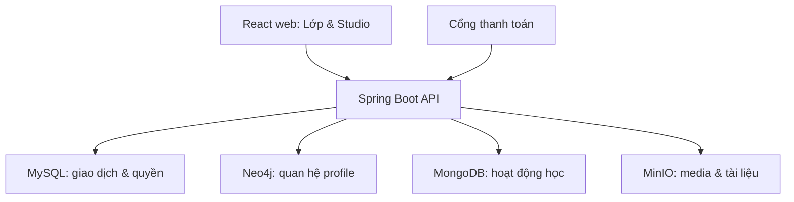

# HLD — Thiết kế tổng quan

**Dự án:** Nền tảng lớp học trực tuyến · **Phiên bản:** 0.1 · **Trạng thái:** BẢN NHÁP · **Ngày:** 23/09/2026

> Tài liệu thiết kế theo thông tin chủ sản phẩm đã cung cấp. Các mục `[CẦN CHỐT]`, `[ĐIỀN KHI THỰC HIỆN]` chưa được xác nhận. Bản nháp không phải biên bản đã ký, kết quả kiểm thử hay cam kết dịch vụ.

## 1. Kiến trúc logic
Một React + TypeScript web app gồm giao diện lớp và Studio; một Spring Boot 4.x/JDK 21 modular monolith cung cấp REST API. MySQL là nguồn chuẩn cho nghiệp vụ; Neo4j lưu đồ thị profile/quan hệ; MongoDB lưu activity hoặc document có cấu trúc linh hoạt; MinIO giữ tệp. Không cho browser nối trực tiếp DB. Payment provider là tích hợp ngoài [CẦN CHỌN].

## 2. Phân vùng backend
`identity`, `classroom`, `staff`, `feed`, `learning`, `exam`, `ranking`, `segment`, `commerce`, `media`, `profile`, `reporting`, `audit`. Controller → application service → domain policy → repository. Tránh phụ thuộc vòng; `commerce` phát entitlement, `learning`/`exam` chỉ hỏi access policy.

## 3. Dữ liệu chủ và dữ liệu dẫn xuất
| Dữ liệu | Nguồn chuẩn | Dẫn xuất/hiển thị |
|---|---|---|
| User, lớp, quyền STAFF, khóa, attempt, điểm, đơn, entitlement | MySQL | Dashboard/read model |
| Quan hệ học viên–lớp–chủ đề–giáo viên | MySQL cho membership; Neo4j cho đồ thị khám phá | Neo4j đồng bộ theo sự kiện |
| Tiến độ hoàn thành, kết quả thi | MySQL | MongoDB activity, Neo4j hành trình nếu cần |
| Video, ảnh, tài liệu | MinIO | MySQL lưu bucket/objectKey/type/size/owner |

## 4. Tính nhất quán và an toàn
Không có transaction ACID xuyên bốn hệ. Một giao dịch nghiệp vụ ghi MySQL và outbox trong cùng transaction; worker đồng bộ Neo4j/MongoDB theo event có idempotency, retry và dead-letter thủ công. Nếu projection chậm, quyền mua/thi luôn đọc MySQL. Upload: cấp token/URL ngắn hạn → upload → backend xác nhận object tồn tại → gắn media record; dọn object mồ côi định kỳ. Download file riêng: kiểm class/entitlement rồi cấp URL ngắn hạn; không lưu URL ký vào DB.

## 5. Bảo mật và vận hành
HTTPS, Spring Security, hash mật khẩu, phân quyền theo lớp và đối tượng, audit quyền/điểm/đơn, giới hạn request auth và thi, bí mật qua env/secret manager. Backup MySQL/MongoDB/Neo4j và version/replication MinIO theo RPO đã ký; metrics API, DB, queue đồng bộ, object storage, payment webhook. Bản đầu có thể vận hành Neo4j/MongoDB như dịch vụ tùy chọn nếu tính năng của chúng chưa được kích hoạt.

## 6. Quy mô cần xác nhận
Số lớp, thành viên đồng thời, video trung bình, giờ thi cao điểm, retention log, RPO/RTO và chi phí hạ tầng `[CẦN CHỐT]`. Không chọn cluster hoặc đưa ra cam kết hiệu năng trước khi có số liệu này.
