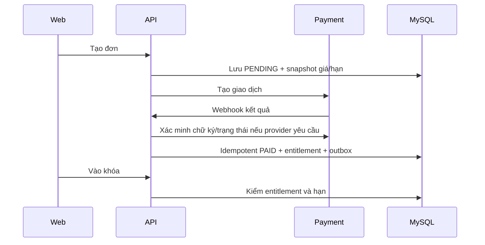

# LLD — Thiết kế chi tiết dữ liệu, API và luồng

**Dự án:** Nền tảng lớp học trực tuyến · **Phiên bản:** 0.1 · **Trạng thái:** BẢN NHÁP · **Ngày:** 23/09/2026

> Tài liệu thiết kế theo thông tin chủ sản phẩm đã cung cấp. Các mục `[CẦN CHỐT]`, `[ĐIỀN KHI THỰC HIỆN]` chưa được xác nhận. Bản nháp không phải biên bản đã ký, kết quả kiểm thử hay cam kết dịch vụ.

## 1. MySQL — mô hình lõi
| Bảng | Trường quan trọng | Ràng buộc |
|---|---|---|
| users | id UUID/ULID, email, password_hash, status | email unique; ID chung toàn hệ |
| classrooms | id, owner_id, slug, title, status | `(owner_id,slug)` unique; owner hiện hữu |
| class_members | class_id, user_id, state, joined_at | `(class_id,user_id)` unique |
| staff_assignments | class_id, user_id, status | STAFF không tự cấp quyền vượt OWNER |
| staff_permissions | assignment_id, module, action, scope_course_id | unique theo bộ khóa; scope nullable = toàn lớp |
| courses | id, class_id, product_id nullable, access_mode, status | access_mode FREE hoặc PURCHASE_REQUIRED |
| sections, lessons | course_id/section_id, position, type, media_id | vị trí unique trong cha; soft delete/archived |
| lesson_progress | user_id, lesson_id, completed_at | unique `(user_id,lesson_id)` |
| posts, comments, lesson_questions | class_id, author_id, visibility, status | kiểm audience và quyền sửa/xóa |
| media_assets | id, class_id, object_key, mime, bytes, status | key độc nhất; không lưu presigned URL |
| products, product_prices | class_id, target_course_id, price, currency, duration_days | lưu snapshot giá/hạn tại order item |
| orders, order_items, payments | buyer_id, class_id, status, amount, provider_ref | unique provider event/idempotency key |
| entitlements | user_id, class_id, product_id, starts_at, expires_at, state | không vượt quá quyền của order được trả tiền |
| exams, exam_audience_rules | class_id, schedule, duration, attempt_limit, scope | audience version cố định khi publish |
| questions, answer_options | exam_id, type, points, answer_key | không gửi answer_key cho học viên |
| exam_attempts, attempt_answers | user_id, exam_id, started_at, submitted_at, score, status | lock/concurrency; một attempt duy nhất mỗi lượt |
| rank_tiers, exam_reward_rules, leaderboard_entries | ngưỡng điểm, điểm quy đổi, tổng điểm | unique `(class_id,user_id)` read model; tính từ result đã publish |
| segments, segment_rules | class_id, operator, criterion, value | chỉ criterion whitelist; cấm SQL tùy ý |
| audit_events, outbox_events | actor, action, before/after reference, event_id | append-only logic; retry idempotent |

Quan hệ chính: classroom 1→N course/member/product/exam; course 1→N section 1→N lesson; user N↔N classroom qua class_member; order 1→N item → entitlement; exam 1→N attempt → answers; lesson 1→N questions. Khóa ngoại theo MySQL; Neo4j/MongoDB chỉ tham chiếu cùng `userId/classId/courseId`, không dùng ID riêng làm nguồn quyền.

## 2. Neo4j và MongoDB
Neo4j: `(:User {userId})-[:MEMBER_OF]->(:Class {classId})`; `(:User)-[:FOLLOWS]->(:Teacher)`; `(:User)-[:INTERESTED_IN]->(:Topic)`. Unique constraint trên `userId`, `classId`, `topicCode`; không lưu mật khẩu/email/số điện thoại làm nguồn chính. MongoDB `learning_events`: `{eventId,userId,classId,courseId,lessonId,type,occurredAt,payload,sourceVersion}`; index `(userId,occurredAt)`, `(classId,occurredAt)` và TTL theo retention đã chốt. Không dùng sự kiện `VIDEO_PLAYED` thay cho hoàn thành bài đã xác nhận ở MySQL.

## 3. Access policy
Thứ tự kiểm: authenticated → class membership/ownership → trạng thái resource → OWNER override trong lớp mình → STAFF permission + scope cho hành động quản trị → student access mode/entitlement/segment. PRO = EXISTS entitlement trả phí ACTIVE với `startsAt <= now < expiresAt` của lớp (giả định D-01). Với exam `COURSE_OWNERS`, kiểm entitlement đúng khóa; với `PRO`, mọi PRO. Điều kiện kết hợp phải có cây quy tắc AND/OR versioned; lần làm đã bắt đầu trước khi hết hạn cần quyết định D-07 `[CẦN CHỐT]`.

## 4. Luồng mua và thi

Thi: kiểm audience/lịch/lượt; tạo attempt với đề snapshot; lưu đáp án định kỳ; submit idempotent; chấm; publish; quy đổi điểm theo reward rule snapshot; tái tạo leaderboard từ kết quả đã công bố. Hệ thống phải hỗ trợ sửa điểm có audit và cập nhật tổng điểm không cộng lặp.

## 5. Quy tắc transaction
MySQL giữ thao tác mua và tạo entitlement trong một transaction; webhook trùng chỉ xử lý một lần. MongoDB/Neo4j cập nhật qua outbox. `payment.status=PAID` không thể do client tự đặt. Xóa khóa có người mua chỉ chuyển ARCHIVED, vẫn bảo đảm quyền truy cập đã bán theo hợp đồng [CẦN CHỐT chính sách].
